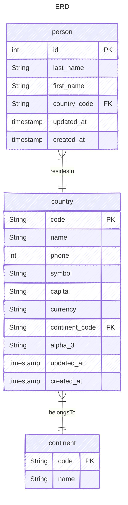

# PYFASTAPI

sample backend using pyfastapi, sqlalchemy, and alembic

## Pre-requisites
- python 3.12
- poetry
- sqlite

## How to run
1. install dependencies `poetry install`
2. copy `.env.example` to `.env` and change the values if needed
2. run the app `poetry run python run.py`
3. call the api endpoint `curl http://localhost:5000/persons`
4. open `http://localhost:5000/docs` to view then openapi docs

## How to run in a container
1. build the image `podman build -t pyfastapi .`
2. run the image `podman run -p 5000:5000 pyfastapi`

note: you can use `docker` instead of `podman` as it is a drop in replacement

## Seed Data
1. run `alembic upgrade head`
2. sql schema and the data should be on `./sql_app.db`
3. refer to `alembic.ini` to change other configuration, it uses .env for the DB url

## Tests
1. make sure main dependencies are installed
2. run `poetry install`
2. run `pytest`, take note that it uses `.env.test` for configuration

## Data Model

