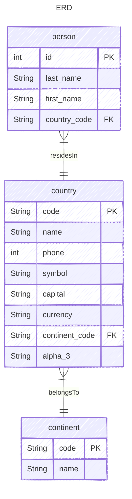

# PYFASTAPI

Sample backend API built with **FastAPI**, **SQLAlchemy 2.x**, and **Alembic**. It demonstrates a layered architecture with CRUD endpoints for `Person`, `Country`, and `Continent`.

## Pre-requisites

- Python 3.12+
- [uv](https://docs.astral.sh/uv/)
- SQLite

## How to run

1. Install dependencies  
   `uv sync --locked --all-extras --dev`

2. Copy `.env.example` to `.env` and change the values if needed  
   `cp .env.example .env`

3. Run the app  
   `uv run python run.py`

4. Call the API endpoint  
   `curl http://localhost:5000/persons`

5. Open `http://localhost:5000/docs` to view the OpenAPI docs

## How to run in a container (WIP)

1. Build the image  
   `podman build -t pyfastapi .`

2. Run the image  
   `podman run -p 5000:5000 pyfastapi`

> Note: You can use `docker` instead of `podman` as it is a drop-in replacement.  
> this part is still WIP.

## Seed Data

1. Run migrations  
   `alembic upgrade head`

2. The SQL schema and seed data will be created in `./sql_app.db`

3. Refer to `alembic.ini` to change other configuration. It uses `.env` for the DB URL.

## Tests

1. Make sure dependencies are installed  
   `uv sync --locked --all-extras --dev`

2. Run the test suite  
   `uv run pytest`

3. Run with coverage  
   `uv run poe coverage`

> Tests automatically set `ENVIRONMENT=test`, which loads `.env.test` for test configuration.

## Data Model

