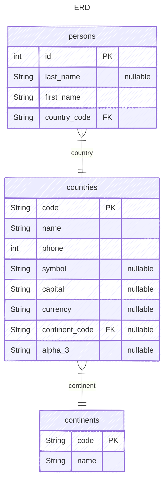

# PYFASTAPI

Sample backend API built with **FastAPI**, **SQLAlchemy 2.x**, and **Alembic**. It demonstrates a layered architecture with full CRUD endpoints for `Person` and read-only list/detail endpoints for `Country` and `Continent`.

## Pre-requisites

- Python 3.12+
- [uv](https://docs.astral.sh/uv/)
- SQLite

## How to run

1. Install dependencies  
   `uv sync --locked --all-extras --dev`

2. Copy `.env.example` to `.env` and change the values if needed  
   `cp .env.example .env`

3. Run the app  
   `uv run python run.py`

4. Call the API endpoint  
   `curl http://localhost:5000/persons`

5. Open `http://localhost:5000/docs` to view the OpenAPI docs

## How to run in a container

1. Build the image  
   `docker build -t pyfastapi .`

2. Run the image  
   `docker run -p 5000:5000 pyfastapi`

> Note: You can use `podman` instead of `docker` as it is a drop-in replacement.

## Seed Data

1. Run migrations  
   `alembic upgrade head`

2. The SQL schema and seed data will be created in `./sql_app.db`

3. The database URL is read from `.env` (or `.env.test` when `ENVIRONMENT=test`) via `pyfastapi/utils/config.py` and passed to Alembic in `alembic/env.py`. `alembic.ini` is used for other Alembic settings.

## Tests

1. Make sure dependencies are installed  
   `uv sync --locked --all-extras --dev`

2. Run the test suite  
   `uv run pytest`

3. Run with coverage  
   `uv run poe coverage`

> Tests automatically set `ENVIRONMENT=test`, which loads `.env.test` for test configuration.

## API Conventions

- **No trailing slashes on collection endpoints.** Routes are registered as `/persons`, `/countries`, and `/continents`. Accessing the trailing-slash variant (e.g., `/persons/`) will receive a `307 Temporary Redirect` to the canonical path.
- **Sort syntax** ( `/persons` and `/countries` only): Prefix with `-` for descending (e.g., `-name`), `+` or no prefix for ascending.
- **Filter syntax** (`/persons` and `/countries` only): Query parameters are mapped to schema fields. String fields use `ILIKE` (`%value%`); others use exact equality.
- **`GET /continents`** returns a plain `List[ContinentSchema]`; it is not paginated and does not support sort/filter parameters.
- **`POST /persons`** creates a person and returns `PersonListSchema` (which includes `country_code` but not the nested country/continent).
- **`PUT /persons/{id}` is an upsert.** If the ID exists it is updated; if it does not exist a new person is created with that ID. Returns `204 No Content`.
- **`DELETE /persons/{id}`** removes the person and returns `204 No Content`. Returns `404 Not Found` if the person does not exist.

## Data Model

